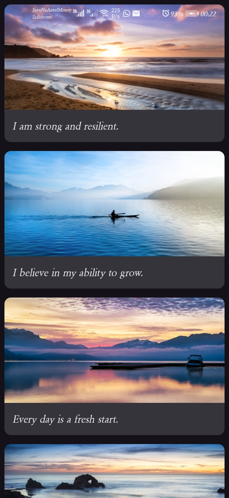

# Affirmations App 🌟

An Android app that displays a scrollable list of positive affirmations with images.

## Built With
- Kotlin
- Jetpack Compose
- Material3
- Android Studio

## Concepts Practiced
- Data classes and data modeling
- LazyColumn for efficient lists
- Composable functions
- Resource management (strings, drawables)
- Clean project architecture (model, data, ui layers)

## Course
Built as part of [Google's Android Developer Course](https://developer.android.com/courses/android-basics-compose/course) — Unit 3

## Screenshots

## Author
Merlin